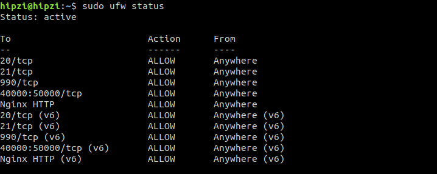
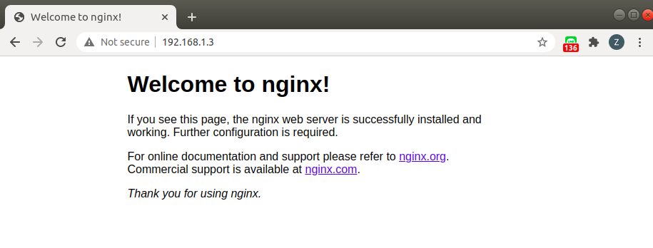
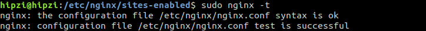
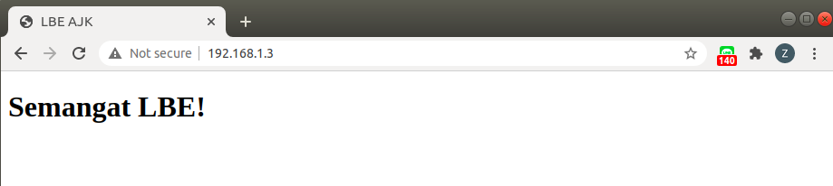
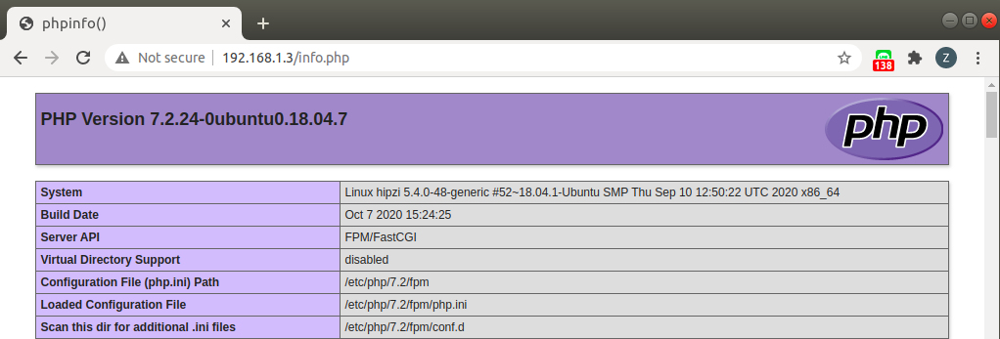

# LEMP

Sub Materi
- <a href="#pengertian">Pengertian LEMP</a>
- <a href="#linux">Linux </a>
- <a href="#nginx">Nginx </a>
- <a href="#mysql">MySQL </a>
- <a href="#php">PHP </a>

## Pengertian LEMP
<justify>

<b>LEMP</b> adalah singkatan dari Linux, Nginx, MySQL, dan PHP. Fungsi LEMP adalah untuk membuat server website dan membantu agar aplikasi menjadi dinamis.

</justify>

## LINUX
<justify>

Linux berperan sebagai sistem operasi di mana Nginx, MySQL, dan PHP berjalan. Linux bersifat <i>open source</i> serta mudah untuk dikonfigurasi.

</justify>

## NGINX
<justify>

Nginx adalah web server <i>open source</i> sebagai server HTTP dan Proxy dengan fokus pada performa dan efisiensi.

### Instalasi

Pertama, mulailah dengan mengupdate indeks paket server, kemudian menginstall Nginx.

    sudo apt update
    sudo apt install nginx

Cek Status Firewal

    sudo ufw status

Jika firewal menyala, pastikan sudah mengaktifkan Nginx, jika belum maka cara mengaktifkannya dengan mengetik

    sudo ufw allow 'Nginx HTTP'

Perubahan dapat dilihat dengan menjalankan:

    sudo ufw status

Output :

Setelah proses instalasi Nginx selesai, pastikan bahwa Nginx telah benar-benar terinstal dengan cara ketikkan alamat IP pada browser

    http://server_domain_atau_IP

Cara mendapatkan alamat IP adalah dengan mengetik command <code> ifconfig</code> pada terminal.

Jika melihat halaman di atas, maka telah berhasil menginstal Nginx.

</justify>

## MySQL
<justify>

Karena telah memiliki web server, maka perlu untuk menginstal MySQL (sistem manajemen database) untuk menyimpan dan mengelola data.

Instal MySQL dengan mengetik :

    sudo apt install mysql-server

Untuk mengamankan instalasi, MySQL dilengkapi dengan <i>script</i> yang akan menanyakan apakah kita ingin mengubah beberapa default yang tidak aman. Mulai <i>script</i> dengan mengetik:

    sudo mysql_secure_installation

<i>Script</i> ini akan menanyakan apakah Anda ingin mengkonfigurasi file <code>VALIDATE PASSWORD PLUGIN</code>

    VALIDATE PASSWORD PLUGIN can be used to test passwords
    and improve security. It checks the strength of password
    and allows the users to set only those passwords which are
    secure enough. Would you like to setup VALIDATE PASSWORD plugin?

    Press y|Y for Yes, any other key for No:

    There are three levels of password validation policy:

    LOW    Length >= 8
    MEDIUM Length >= 8, numeric, mixed case, and special characters
    STRONG Length >= 8, numeric, mixed case, special characters and dictionary                  file

    Please enter 0 = LOW, 1 = MEDIUM and 2 = STRONG: 

    Please set the password for root here.

    New password:

    Re-enter new password:

Setelah selesai, bisa menjalankan MySQL dengan mengetik :

    sudo mysql

Menjalankan perintah <code>exit</code> jika ingin keluar dari MySQL.

</justify>

## PHP
<justify>

Setelah instalasi Nginx dan MySQL berhasil, langkah berikutnya adalah menginstal PHP agar dapat menghasilkan konten dinamis.

Masukkan perintah berikut pada terminal untuk memulai instalasi :

    sudo apt install php-fpm php-mysql

Perintah tersebut akan menginstall versi terbaru PHP serta beberapa modul tambahan.

langkah selanjutnya adalah membuat konfigurasi pada Nginx, lokasinya terletak pada <code>/etc/nginx/sites-available</code>

Dalam contoh ini, file konfigurasi blok server baru diberi nama semangat-lbe.conf

    sudo nano /etc/nginx/sites-available/semangat-lbe.conf

File konfigurasi :

    server {
            listen 80;
            root /var/www/semangat-lbe;
            index index.php index.html index.htm index.nginx-debian.html;
            server_name nama_domain_atau_alamat_ip;

            location / {
                    try_files $uri $uri/ =404;
            }

            location ~ \.php$ {
                    include snippets/fastcgi-php.conf;
                    fastcgi_pass unix:/var/run/php/php7.2-fpm.sock;
            }

            location ~ /\.ht {
                    deny all;
            }
    }

keterangan :

- 
<code>listen</code> : Mendefinisikan port apa yang akan digunakan oleh Nginx. Dalam hal ini, ia akan menggunakan port 80 (HTTP)
 
- 
<code>root</code> : Tempat di mana file dokumen situs web disimpan
 
- 
<code>root</code> : Tempat di mana file dokumen situs web disimpan
 
- 
<code>server_name</code> : Mendefinisikan server mana yang harus digunakan. Arahkan petunjuk ini ke nama domain server atau alamat IP Publik
 

Setelah menambahkan file konfigurasi, simpan dan tutup file. Aktifkan blok server baru dengan membuat tautan simbolis dari file konfigurasi blok server baru dalam <code>/etc/nginx/sites-available/file-konfigurasi</code> ke <code>/etc/nginx/sites-enabled/</code>:

    sudo ln -s /etc/nginx/sites-available/semangat-lbe.conf /etc/nginx/sites-enabled/

Kemudian, <i>unlink</i> tautan file konfigurasi default pada <code>/etc/nginx/sites-enabled/</code>:

    sudo unlink /etc/nginx/sites-enabled/default

Uji file konfigurasi baru yang telah dibuat agar dapat mengetahui jika ada kesalahan sintaks dengan mengetik:

    sudo nginx -t

Output :

Kemudian <i>reload</i> Nginx untuk membuat perubahan yang diperlukan:

    sudo service nginx reload

Kemudian <i>reload</i> Nginx untuk membuat perubahan yang diperlukan:

Untuk menguji agar dapat memvalidasi bahwa Nginx dapat menyerahkan .phpfile dengan benar ke prosesor PHP maka dengan membuat file info.php.

    sudo nano /var/www/semangat-lbe/info.php

File info.php :

    <?php
        phpinfo();
    ?>

Lalu untuk mengecek silahkan mengetik nama domain server atau alamat IP publik diikuti dengan <code>/info.php</code> pada web browser pada web browser

    http://server_domain_atau_IP/info.php

Output :

</justify>

## Referensi
<justify>

- https://www.digitalocean.com/community/tutorials/how-to-install-linux-nginx-mysql-php-lemp-stack-ubuntu-18-04
- https://www.niagahoster.co.id/blog/cara-install-lemp-di-ubuntu/
- https://www.digitalocean.com/community/tags/lemp
</justify>

